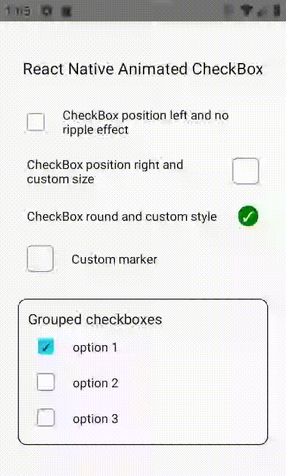

<div align="center">
  
</div>
<br>
<div align="center">
  <strong>A customizable animated checkbox component for React Native</strong>
</div>
<br>

<h2>Table of Contents</h2>
<details>
  <summary>Table of Contents</summary>
  <li><a href="#about">About</a></li>
  <li><a href="#install">Install</a></li>
  <li><a href="#usage">Usage</a></li>
  <li><a href="#props">Props</a></li>
  <li><a href="#contribute">Contribute</a></li>
  <li><a href="#license">License</a></li>
</details>

## About

A customizable animated checkbox component for React Native. No extra library required.

## Install

```sh
$ npm install --save react-native-checkbox-animated
```

```sh
$ yarn add react-native-checkbox-animated
```

## Usage

<div align="center">
  
</div>

```js
// ... Imports
import React, { useState } from "react";
import Checkbox from "react-native-checkbox-animated";

const App = () => {
  const [checked, setChecked] = useState(false);

  return (
    <View>
      ...
      <CheckBox
        label="your label here"
        onValueChange={val => setChecked(val)}
        checked={checked}
      />
      ...
    </View>
  );
};
```

Checkout examples.js for the above examples.

## Props

<table style="width:80%">
  <tr>
    <th>Property</th>
    <th>Description</th>
    <th>Required</th>
    <th>Type</th>
    <th>Default Value</th>
  </tr>
  <tr>
    <td><code>checked</code></td>
    <td>Current state of the checkBox</td>
    <td>true</td>
    <td>boolean</td>
    <td>false</td>
  </tr>
  <tr>
    <td><code>onValueChange</code></td>
    <td>Callback when checkbox is pressed. Return checkbox state</td>
    <td>true</td>
    <td>function => boolean</td>
    <td>-</td>
  </tr>
  <tr>
    <td><code>size</code></td>
    <td>Specify the size of the checkBox</td>
    <td>false</td>
    <td>number</td>
    <td>20</td>
  </tr>
  <tr>
    <td><code>label</code></td>
    <td>Text or React Component that follows the checkbox</td>
    <td>false</td>
    <td>string / React Component</td>
    <td>Your label here</td>
  </tr>
  <tr>
    <td><code>touchableLabel</code></td>
    <td>Specify if state of checkbox changes when label is pressed</td>
    <td>false</td>
    <td>boolean</td>
    <td>true</td>
  </tr>
  <tr>
    <td><code>group</code></td>
    <td>Specify if checkbox will behave as in a group</td>
    <td>false</td>
    <td>boolean</td>
    <td>false</td>
  </tr>
  <tr>
    <td><code>checkedBackgroundColor</code></td>
    <td>Specify the color of checkbox's background when it's checked</td>
    <td>false</td>
    <td>string</td>
    <td>#22cdf0</td>
  </tr>
  <tr>
    <td><code>unCheckedBackgroundColor</code></td>
    <td>Specify the color of checkbox's background when it's not checked</td>
    <td>false</td>
    <td>string</td>
    <td>white</td>
  </tr>
  <tr>
    <td><code>checkedBorderColor</code></td>
    <td>Specify the color of checkbox's border when it's checked</td>
    <td>false</td>
    <td>string</td>
    <td>grey</td>
  </tr>
  <tr>
    <td><code>unCheckedBorderColor</code></td>
    <td>Specify the color of checkbox's border when it's not checked</td>
    <td>false</td>
    <td>string</td>
    <td>transparent</td>
  </tr>
  <tr>
    <td><code>borderWidth</code></td>
    <td>Border width of checkbox</td>
    <td>false</td>
    <td>number</td>
    <td>1</td>
  </tr>
  <tr>
    <td><code>rippleEffect</code></td>
    <td>Specify if label has ripple effect on press when touchableLabel is set to true</td>
    <td>false</td>
    <td>boolean</td>
    <td>true</td>
  </tr>
  <tr>
    <td><code>rippleColor</code></td>
    <td>Specify the color of ripple effect when it is set to true</td>
    <td>false</td>
    <td>string</td>
    <td>black</td>
  </tr>
  <tr>
    <td><code>checkPosition</code></td>
    <td>Specify the position where the checkbox will be rendered</td>
    <td>false</td>
    <td>enum('left' | 'right')</td>
    <td>left</td>
  </tr>
  <tr>
    <td><code>checkBoxRadius</code></td>
    <td>Specify the radius of the checkbox</td>
    <td>false</td>
    <td>number</td>
    <td>20% of size</td>
  </tr>
  <tr>
    <td><code>rounded</code></td>
    <td>Set the shape of the checkbox to be rounded instead of a square</td>
    <td>false</td>
    <td>boolean</td>
    <td>false</td>
  </tr>
  <tr>
    <td><code>checkMarkSize</code></td>
    <td>Specify the size of the checkbox</td>
    <td>false</td>
    <td>number</td>
    <td>15</td>
  </tr>
  <tr>
    <td><code>checkMarkColor</code></td>
    <td>Specify the color of the default checkmark</td>
    <td>false</td>
    <td>string</td>
    <td>black</td>
  </tr>
  <tr>
    <td><code>animationType</code></td>
    <td>Specify the custom animation type</td>
    <td>false</td>
    <td>enum('scale' | 'left' | 'reveal')</td>
    <td>scale</td>
  </tr>
  <tr>
    <td><code>checkStyle</code></td>
    <td>Text styles props applied to the checkmark character</td>
    <td>false</td>
    <td>TextStyle</td>
    <td>{}</td>
  </tr>
  <tr>
    <td><code>labelStyle</code></td>
    <td>Text styles props applied to your label</td>
    <td>false</td>
    <td>TextStyle</td>
    <td>{}</td>
  </tr>
  <tr>
    <td><code>labelContainerStyle</code></td>
    <td>View styles props applied to label container</td>
    <td>false</td>
    <td>ViewStyle</td>
    <td>{}</td>
  </tr>
  <tr>
    <td><code>containerStyle</code></td>
    <td>View styles props applied to the main container</td>
    <td>false</td>
    <td>ViewStyle</td>
    <td>{}</td>
  </tr>
  <tr>
    <td><code>checkboxContainerStyle</code></td>
    <td>View styles props applied to the container that wraps the checkbox</td>
    <td>false</td>
    <td>ViewStyle</td>
    <td>{ padding: 10 }</td>
  </tr>
  <tr>
    <td><code>boxStyle</code></td>
    <td>View styles props applied to the box that wraps the checkmark.</td>
    <td>false</td>
    <td>ViewStyle</td>
    <td>{}</td>
  </tr>
  <tr>
    <td><code>customMarker</code></td>
    <td>Replace the checkmark for your custom checkmark</td>
    <td>false</td>
    <td>ReactNode</td>
    <td>-</td>
  </tr>
</table>

## Contribute

Contributions are welcome. Please open up an issue or create PR if you would like to help out.

Note: If editing the README, please conform to the [standard-readme](https://github.com/RichardLitt/standard-readme) specification.

## License

Licensed under the MIT License.
